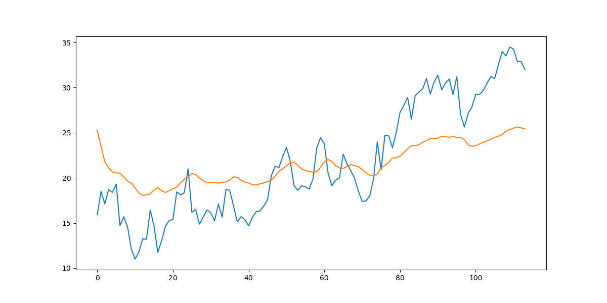

Time Series Prediction with RNN, LSTM & GRU

Overview

This project uses RNN, LSTM and GRU neural networks to predict future values in a time series dataset.
The goal is to predicting nex days weather.

Models
* RNN (Recurrent Neural Network)
* LSTM (Long Short-Term Memory)
* GRU (Gated Recurrent Unit)

Results

| Model | MSE     | MAE   |
| ----- | --------| ----- |
| RNN   | 20.26   | 3.87  |
| LSTM  | 34.57   | 4.6   |
| GRU   | 36.39   | 5.4   |


Insight

Reducing the sequence window size significantly improved performance due to the small dataset (~100 samples).

Output Example



Conclusion

RNN achieved the lowest MSE (28.39) and MAE (4.69), indicating that for this small dataset, a simple RNN outperformed more complex models.
LSTM and GRU performed slightly worse (MSE ~44, 42; MAE ~5.05), likely due to the limited data size where complex architectures may overfit.
Overall, for small datasets, simpler models like RNN can provide better predictions, while LSTM and GRU are more beneficial for larger datasets or longer sequences.
This experiment demonstrates the importance of choosing the right model complexity relative to dataset size.

Project Structure

```
project/
│
├── ClimateTest.csv
├── weather_rnn.ipynb
├── prediction_plot.png
├── requirements.txt
└── README.md
```
